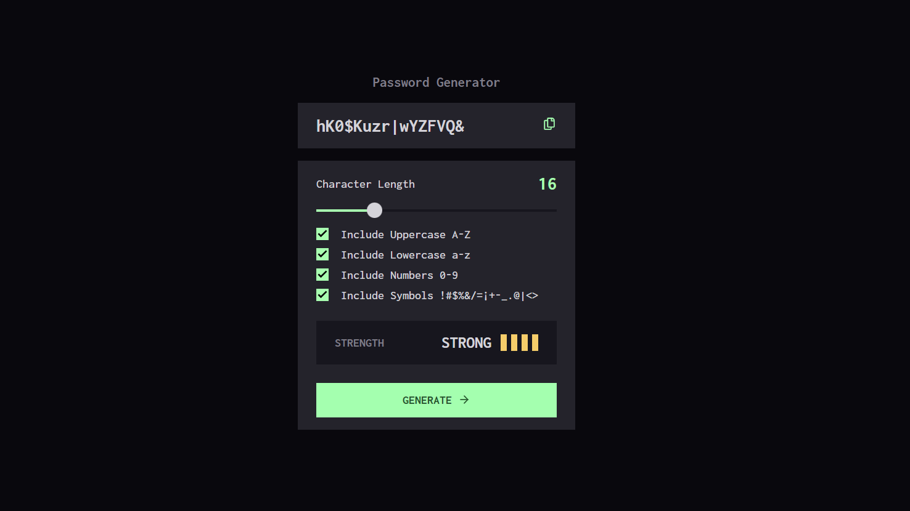

# Password Generator 
The Password Generator App provides a random password up to 64 characters. You can add Uppercase, Lowercase, Numbers, and Symbols.

# Snapshot



# Demo

[Password-Generator - Live ◀️](https://password-generator-dhyanpatel110.vercel.app/)


## Project setup

### Clone this repo

```
git clone https://github.com/dhyanpatel110/Password-Generator.git
```

### Install dependencies

```
npm install
```

### Compiles and hot-reloads for development

```
npm run start
```

### Compiles and minifies for production

```
npm run build
```

### Lints and fixes files

```
npm run lint
```
